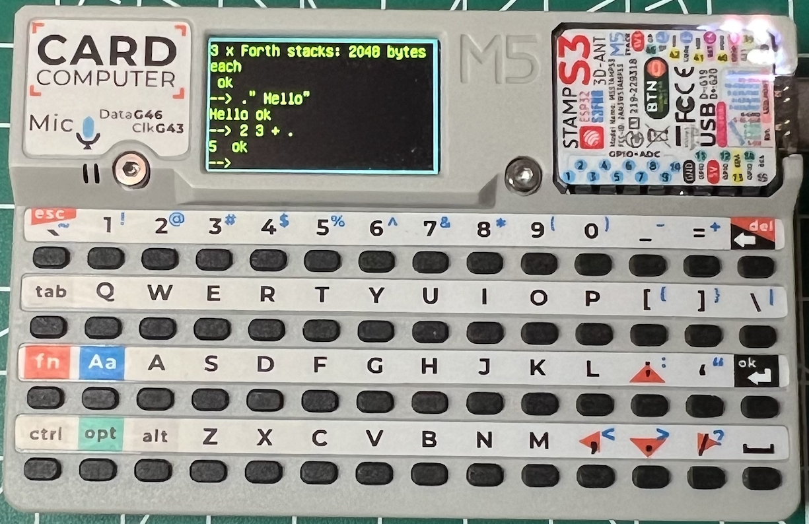

# M5CardForth (alpha)

[EN|[日本語](readmeJa.md)]

## Summary 

A simple console for M5Cardputer + ESP32forth.

The current release is alpha.

The following components are roughly combined:

* [ueforth](https://github.com/flagxor/ueforth)
* [M5Cardputer](https://github.com/m5stack/M5Cardputer)
* [LovyanGFX](https://github.com/lovyan03/LovyanGFX)
* [FastLED](https://github.com/FastLED/FastLED)

Build / flash the project with [Platformio](https://platformio.org/).

## Console

At startup, the console reads from the USBSerial input. Open `PlatformIO : Serial Console` and type on your computer. To use the M5Cardputer keyboard, type `m5key-on`. 

The following words can be used to switch the console I/O : `m5key-on m5key-off m5type-on m5type-off`

## Cardputer keyboard

Supported keys:

* Alphanumeric and symbols
* `Shift`
* `Enter` and `BS`

The ctrl/opt/alt/fn/esc keys do not work.

## Sample programs

[forth/fastLed.fs](forth/fastLed.fs) 

[forth/lgfx.fs](forth/lgfx.fs)

[forth/M5StampS3-gpio.fs](forth/M5StampS3-gpio.fs) 

## Add'l Internal words

Newly defined words to access Cardputer features. Currently under development, the specs will be changed in the future.

-> ([See this page](cpwords.md))

## Todo

* switch between Cardputer console and serial ✅
* rgb led ✅
* backspace ✅
* graphics ✅
* sd card ✅
* sound 
* mic
* (ir)
* (clock)
* (wifi)

Have fun.