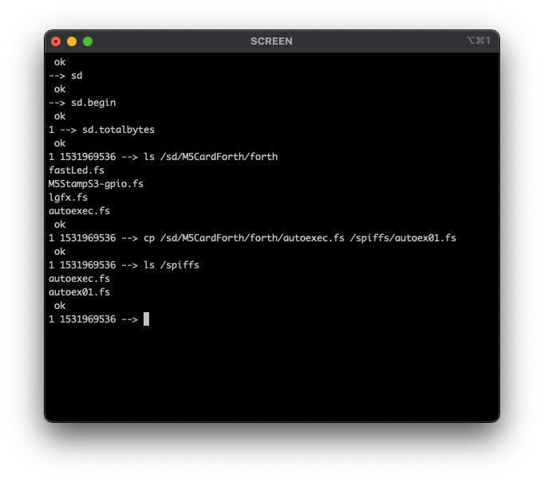

# M5CardForth (alpha)

[[EN](readme.md)|JA]


## 概要

M5Cardputer を使って ESP32forth コンソールを作っています。
まだ作業中なので仕様は頻繁に変更されます。

以下のコンポーネントを使用しています。

* [ueforth](https://github.com/flagxor/ueforth)
* [M5Cardputer](https://github.com/m5stack/M5Cardputer)
* [LovyanGFX](https://github.com/lovyan03/LovyanGFX)
* [FastLED](https://github.com/FastLED/FastLED)

プロジェクトは [Platformio](https://platformio.org/) でビルド、書き込みできます。

また後述するシェアコードを使って M5Burner からバイナリをインストールできます。

## 対応モデルとインストール

### Original Cardputer

リリース [v0.0.9](https://github.com/ryu10/M5CardForth/releases/tag/v0.0.9) ([main](https://github.com/ryu10/M5CardForth/tree/main))

M5burner Share Code: XieOPr3qjkD2rmdY

### Cardputer v1.1 / Cardputer-Adv

リリース [v0.1.0-s3a](https://github.com/ryu10/M5CardForth/releases/tag/v0.1.0-s3a) ([s3a](https://github.com/ryu10/M5CardForth/tree/s3a))

M5burner Share Code: Ow3k7C9dWPOiZ7Zh

## コンソール

初期状態で入力は Platformio Serial Monitor コンソール、出力は M5Cardputer ディスプレイです。Platformio の Serial Monitor コンソールウィンドウ内をクリックしてからコンピュータのキーボードを使って入力します。

`m5key-on` と入力すると M5Cardputer キーボードに切り替わります。

`m5key-on m5key-off m5type-on m5type-off` の各ワードで、コンソールの入出力を切り替えられます。

### M5Cardputer を単体で使用する

USB ケーブルを接続せず M5Cardputer 単体で使用するには以下の手順で起動します。

1. 以下のいずれかの操作を行います。
    1. M5Cardupter の電源を入れる
    2. リセットボタン（本体左上）を押して放す
2. 直後に M5Cardputer の `BtnG0` ボタン（本体右上）を押します。
3. 画面に `ok` プロンプトが表示されたら `BtnG0` ボタンを放します。

この方法で起動すると M5Cardputer のキーボードとコンソール出力が使用可能になります。

## Cardputer キーボード

以下のキーが使えます。

* 英数文字および記号入力キー
* `Shift` キー ('`Aa`')
* `Enter` キーと `BS` キー

`ctrl`/`opt`/`alt`/`fn`/`esc` キーは機能しません。

## サンプルコード

[forth/fastLed.fs](forth/fastLed.fs) : RGB LED の操作

[forth/lgfx.fs](forth/lgfx.fs) : LovyanGFX でグラフィックス表示

[forth/M5StampS3-gpio.fs](forth/M5StampS3-gpio.fs) : Grove PortA の G1 と G2 を制御

Serial Monitor コンソールにコピペして使います。入力バッファに上限があるためコンソールには大量のテキストを一度に貼り付けられません。複数回に分けてコピペしてください。

## 追加 Forth ワード

各コンポーネントの機能を呼び出します。作者が Forth 初学者のためワード定義の記述や配置はあまりまとまっていません。今後整理します。

-> ([See this page](cpwords.md))

## SD カードサポート

ESP32Forth の ```SD``` ボキャブラリを使用します。



### ブロックエディタ使用例

```
sd
sd.begin
use /sd/myblk
s" /sd/myblk" open-blocks
editor
0 a : hi ." Howdy!" ;
update
save-buffers
0 load hi
```

```visual editor /sd``` は動きません。 

### /spiffs/autoexec.fs の使用

[forth/autoexec.fs](forth/autoexec.fs) を SD カード経由で `/spiffs/autoexec.fs`にコピーするとファイルの内容が ESP32Forth 起動時に自動実行されます。`src/autoexec.fs` にはサンプルコードの内容が `m5demo` ボキャブラリとして記述されています。下記をコンソールに入力するとデモプログラムが実行されます。

```
m5demo
go2
```

## Todo

* switch between Cardputer console and serial ✅
* rgb led ✅
* backspace ✅
* graphics ✅
* sd card ✅
* sound 
* mic
* (ir)
* (clock)
* (wifi)
